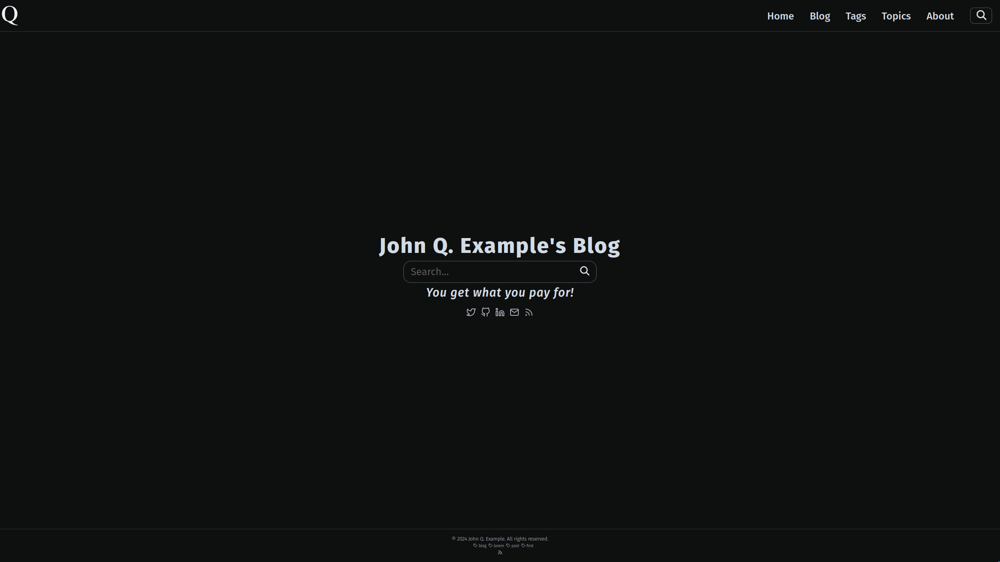

# Sleek

Sleek is a clean and ultra-minimalist [Zola](https://www.getzola.org) theme with
a focus on elegant typography designed for those who wish to let their writing
speak for itself.

Sleek is based on the [Hermit](https://hugo-theme-hermit.netlify.app) theme,
which was originally designed for [Hugo](https://gohugo.io) and then later
ported to [Zola](https://versbinarii.gitlab.io/blog/). Many thanks to the
designers of these themes for providing a source of inspiration to Sleek and
for their commitment to a minimalist blogging aesthetic.

However, once you leave the homepage you will see that Sleek has many
differences to Hermit in its taxonomy structure, search functionality and post
display styling. It also includes several features not natively supported by
Zola.

## Demo

Check out an example Sleek website [here](https://sleek-4lj.pages.dev/), hosted
and deployed on [Cloudflare Pages](https://pages.cloudflare.com/) using their
Github Continuous Integration pipeline.

Note: for users who wish to host their Zola website on Cloudflare, while Zola is
currently a supported framework I still ran into some issues deploying the site.

Here are the workarounds:

1) Downgrade the build image used for deploying your site from `v2` back to `v1`

2) Set the `ZOLA_VERSION` environment variable to whatever version you are
   using to develop your site locally.

## Features

To get a sense of what features Zola is capable of, I encourage you to check out
their extensive
[documentation](https://www.getzola.org/documentation). If you do not find the
style of Sleek to be your to your liking, feel free to check out the many
[themes](https://www.getzola.org/themes/) that have either been created for or
ported to Zola by its large user base.

In addition to the many features supported by Zola, Sleek boasts:

* [MathJax](https://www.mathjax.org/) support
* Consistent humanist [typeface](https://en.wikipedia.org/wiki/Fira_(typeface))
    for text, code and equations
* Real-time static search powered by
    [Elasticlunr.js](http://http://elasticlunr.com/)
* Support for a user-provided SVG logo
* SVG icons supported for many of the most popular social media websites
* Balanced, limited, use of static JavaScript to maximize features while
  minimizing page load times
* Semantic HTML components are preferred wherever they're applicable

## Configuration

Configuration of the theme's options is done in a TOML file.

## Bugs

If you encounter any bugs in your usage of Sleek, please make a Github
[issue](https://github.com/CarterLevinson/sleek/issues) and I will do my best to
resolve it promptly.
